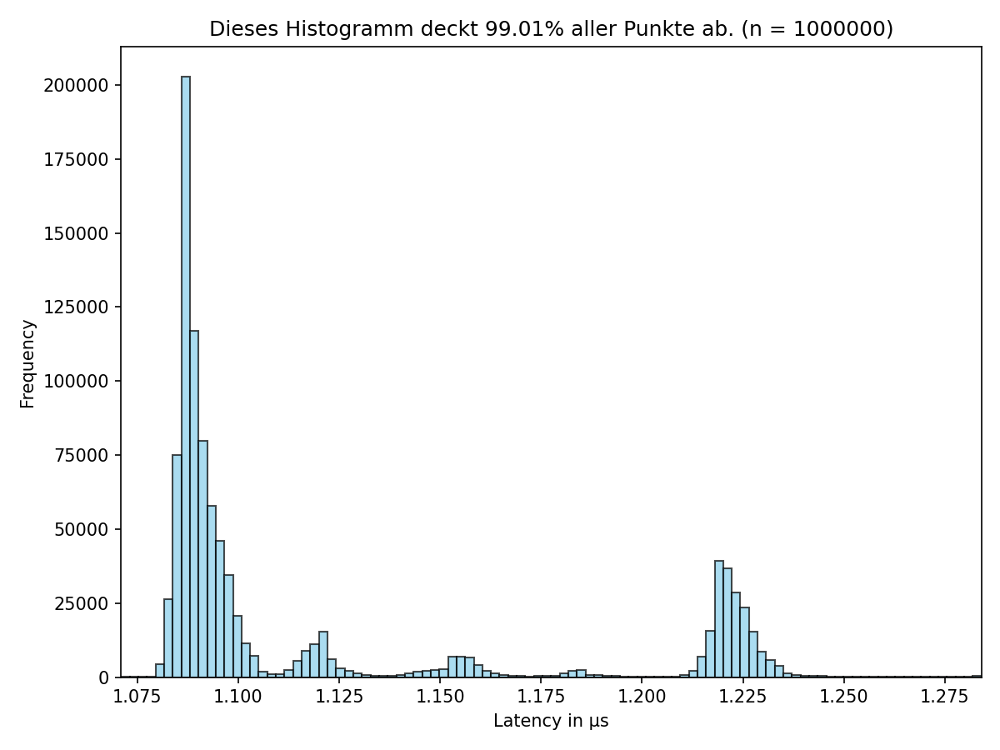
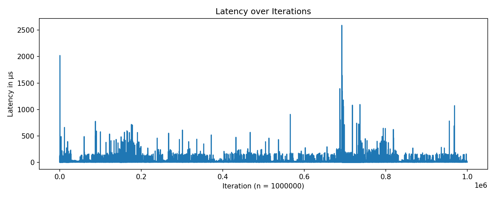

# Report Abgabe 1

Ich habe zwei verschiedene Arten der Pipe-Latenzmessung implementiert.

## Messung der Latenz im gleichen Prozess (pipe.cpp)

`pipe.cpp`

Diese Implementierung misst die Latenz einer Pipe, indem sie Daten im gleichen Prozess durch die Pipe sendet und empfängt. Der Vorteil dieser Methode ist, dass sie einfach zu implementieren ist und keine zusätzlichen Prozesse benötigt. Allerdings spiegelt sie möglicherweise nicht die tatsächliche Latenz wider, die in realen Szenarien auftritt, in denen Daten zwischen verschiedenen Prozessen übertragen werden.

Die Datei führt folgende Schritte innerhalb einer Schleife aus:

1. Erstellung der Pipe mittels `pipe()`.
2. Start der Zeitmessung.
3. Schreiben von Daten in die Pipe mit `write()`.
4. Lesen der Daten aus der Pipe mit `read()`.
5. Stoppen der Zeitmessung.
6. Schließen der Pipe mittels `close()`.
7. Anhängen der Messung an eine CSV-Datei zur späteren Analyse.

## Messung der Latenz zwischen zwei Prozessen (pipe_fork.cpp)

`pipe_fork.cpp`

Diese Implementierung verwendet die `fork()`-Systemaufruf, um einen Kindprozess zu erstellen, der Daten durch die Pipe sendet und empfängt. Diese Methode simuliert eine realistischere Umgebung, in der Daten zwischen zwei separaten Prozessen übertragen werden. Dadurch kann die gemessene Latenz genauer die tatsächlichen Bedingungen widerspiegeln, unter denen Pipes in der Praxis verwendet werden. Allerdings war die Implementierung komplexer und Sie erfordert mehr Ressourcen, da zwei Prozesse beteiligt sind.

Die Datei führt folgende Schritte aus:

1. Erstellung zwei Pipes für die bidirektionale Kommunikation mittels `pipe()`.
2. Erstellung eines Kindprozesses mit `fork()`.

3. Im Elternprozess (in Schleife):

    - Start der Zeitmessung.
    - Schreiben von Daten in die Pipe zum Kindprozess mit `write()`.

    - Im Kindprozess:

        - Lesen der Daten aus der Pipe vom Elternprozess mit `read()`.
        - Schreiben der Antwortdaten in die Pipe zum Elternprozess mit `write()`.

    - Lesen der Antwortdaten aus der Pipe vom Kindprozess mit `read()`.
    - Stoppen der Zeitmessung.

4. Schließen der Pipes mittels `close()`.

## Messergebnisse

### Vorgehensweise

Es wurden jeweils 1.000.000 Messungen durchgeführt. Die Zeitnahme ist über die im Helper bereitgestellte stopwatch realisiert. Gemessen habe ich meinem (schon etwas in die Jahre gekommenem) PC mit 4-Kern Intel(R) Core(TM) i5-4590 CPU @ 3.30GHz. Als OS nutze ich das Arch Linux Derivat CachyOS mit 6.17.7-3-cachyos Kernel. Es verfügt im Gegensatz zum klassischen Linux Kernel unter anderem über einen angepassten Scheduler (Kein Completely Fair Scheduler).

### Ergebnisse

#### Vergleich der statistischen Kenngrößen

| alle Angaben in µs | mean | median | min   | max     | std   | 0.95-quantile | 0.99-quantile | 0.999-quantile |
| ------------------ | ---- | ------ | ----- | ------- | ----- | ------------- | ------------- | -------------- |
| pipe.cpp           | 1.2  | 1.09   | 1.071 | 765.98  | 2.756 | 1.227         | 1.284         | 11.063         |
| icp-pipe.cpp       | 6.71 | 5.49   | 3.26  | 2589.59 | 9.155 | 10.26         | 14.86         | 76.25          |

Es fällt auf, dass die Latenz bei der Messung mit fork() deutlich höher ist als bei der Messung im gleichen Prozess. Dies liegt daran, dass die Kommunikation zwischen zwei Prozessen zusätzliche Overheads verursacht, oder spezifischer zwei zusätzliche Kontextwechsel zwischen den Prozessen notwendig sind.

### Plots

`pipe.cpp`

  
  
  

 

Man sieht, dass es einige deutliche Ausreißer gibt. Diese könnten durch andere Systemaktivitäten Hintergrundprozesse verursacht werden. Ausserdem interessant ist sind die unterschiedlichen diskreten Verteilungsgipfel. Grund dafür könnten die unterschiedlichen Cache-Ebenen des Prozessors sein (L1, L2, L3). Der zweithöchste Gipfel bei ca 1.225 µs könnte durch Interationen in denen ein Interrupt stattgefunden hat verursacht worden sein.
  

`ipc-pipe.cpp`

  
  
  

  

Die Existenz von zwei eng beieinander liegenden Hauptgipfeln deutet oft auf unterschiedliche Pfade im Kernel-Scheduler hin. Der Gipfel bei etwa 5,3 µs ist der Best-Case, bei dem der Kernel $\text{A}$ blockiert, sofort $\text{B}$ aufweckt, $\text{B}$ antwortet, und der Kernel $\text{A}$ sofort wieder aufweckt. Der Gipfel bei etwa 5,7 µs könnte eine minimale zusätzliche Verzögerung durch eine notwendige Scheduler-Operation oder einen minimalen Cache-Zustandsverlust darstellen.
